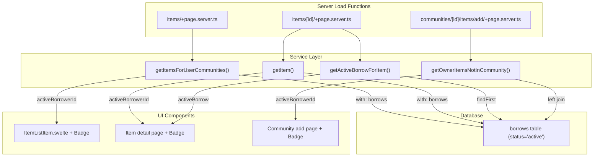

# Item Borrow Status Indicators

## Current State

- Items have a `borrows` relation (`many(borrows)` in [relations.ts](src/lib/server/db/relations.ts)) with a `status` enum: `pending | active | returned | cancelled`.
- An "active" borrow means the item is currently lent out.
- The availability filter in `getItemsForUserCommunities` already checks for active borrows, but **does not return borrow info per item**.
- None of the three target views currently display borrow status.

## Data Layer

### 1. Extend `getItemsForUserCommunities` ([src/lib/server/services/itemsService.ts](src/lib/server/services/itemsService.ts))

The Drizzle `with` clause already loads `tagsToItems` and `lender`. Add `borrows` with a filter for `status: 'active'`:

```ts
with: {
  tagsToItems: { with: { tag: true } },
  lender: true,
  borrows: {
    where: (t, { eq }) => eq(t.status, 'active'),
    columns: { borrowerId: true }
  }
}
```

In the `.map()`, derive an `activeBorrowerId` field:

```ts
activeBorrowerId: rest.borrows?.[0]?.borrowerId ?? null
```

This avoids N+1 queries; at most one borrow will be active per item.

### 2. Extend `getItem` ([src/lib/server/services/itemsService.ts](src/lib/server/services/itemsService.ts))

Same approach: add `borrows` to the `with` clause so the detail page gets the active borrower ID.

### 3. Add `getActiveBorrowForItem` to [src/lib/server/services/borrowsService.ts](src/lib/server/services/borrowsService.ts)

```ts
export const getActiveBorrowForItem = async (itemId: number) => {
  return await db.query.borrows.findFirst({
    where: (t, { eq, and }) => and(eq(t.itemId, itemId), eq(t.status, 'active')),
    columns: { borrowerId: true, id: true }
  });
};
```

This serves as a targeted lookup for the individual item detail page, which loads a single item via `getItem`.

### 4. Update individual item page server load ([src/routes/(authed)/items/[id]/+page.server.ts](src/routes/(authed)/items/[id]/+page.server.ts))

After fetching the item, also fetch the active borrow and return `activeBorrow` in the page data. This enables the detail page to show who is borrowing the item.

### 5. Community items add page ([src/routes/(authed)/communities/[id]/items/add/+page.server.ts](src/routes/(authed)/communities/[id]/items/add/+page.server.ts))

`getOwnerItemsNotInCommunity` in [communitiesService.ts](src/lib/server/services/communitiesService.ts) uses a raw `select()`. Extend it with a left join on `borrows` (filtered to `status = 'active'`) to include a `borrowerId` column per item, or switch to a Drizzle relational query. The simpler option is a left join adding `borrows.borrowerId` aliased as `activeBorrowerId`.

## UI Layer

### 6. Create a `badge` recipe ([src/lib/theme/recipes/badge.ts](src/lib/theme/recipes/badge.ts))

Per ADR 0004, use `defineRecipe` for reusable components. The badge needs a `status` variant:

- `**borrowed**` (you are the borrower): primary palette background/text, e.g. `colorPalette: 'primary'` surface treatment.
- `**unavailable**` (someone else is borrowing): muted/neutral treatment using `fg.muted` + `bg.subtle` to convey "not actionable."

Register the recipe in [src/lib/theme/recipes/index.ts](src/lib/theme/recipes/index.ts) and add to `panda.config.ts`.

### 7. Create `Badge.svelte` ([src/lib/components/Badge.svelte](src/lib/components/Badge.svelte))

A small component that accepts `variant` and `children`/`label` props, applying the `badge` recipe.

### 8. Update `ItemListItem.svelte` ([src/lib/components/ItemListItem.svelte](src/lib/components/ItemListItem.svelte))

- Add optional `activeBorrowerId: string | null` to the props.
- In the `header` snippet (next to the item name), render a `Badge`:
  - If `activeBorrowerId === currentUserId`: badge with variant `borrowed`, label "Borrowing".
  - Else if `activeBorrowerId` is truthy: badge with variant `unavailable`, label "Unavailable".
- Conditionally hide the "Borrow" action button when the item has an active borrow.

### 9. Update item detail page ([src/routes/(authed)/items/[id]/+page.svelte](src/routes/(authed)/items/[id]/+page.svelte))

Add a `Badge` in the header area (next to the item title or in the subheader) using the same logic as `ItemListItem`.

### 10. Update community items add page ([src/routes/(authed)/communities/[id]/items/add/+page.svelte](src/routes/(authed)/communities/[id]/items/add/+page.svelte))

Next to each item name in the checkbox list, show a "Lent out" badge if `activeBorrowerId` is present. Since this page only shows the current user's own items, the borrower is always someone else.

## Data Flow




