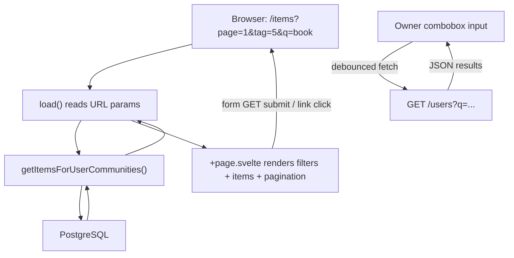

# Community Items Browsing Page

## Context

Currently `[src/routes/(authed)/items/+page.server.ts](src/routes/(authed)`/items/+page.server.ts) loads only the current user's items via `getAllItemsByOwnerId`. This moves to `/users/me/items`. The new `/items` becomes a discovery page showing items from all communities the user belongs to, with filtering and pagination.

Existing item CRUD routes (`/items/new`, `/items/[id]`, `/items/[id]/edit`, etc.) stay at their current paths unchanged.

## 1. Move "My Items" to `/users/me/items`

Create new route files:

- `src/routes/(authed)/users/me/items/+page.server.ts` -- copy current load logic from `[items/+page.server.ts](src/routes/(authed)`/items/+page.server.ts)
- `src/routes/(authed)/users/me/items/+page.svelte` -- copy current page from `[items/+page.svelte](src/routes/(authed)`/items/+page.svelte)
- `src/routes/(authed)/users/me/items/+layout.svelte` -- heading "My Items", link to `/items/new`

## 2. Update all internal links

Use `resolveRoute` from `$app/paths` for constructing all route paths. This provides type-safe path resolution from route IDs with parameters (e.g. `resolveRoute('/items/[id]', { id: String(item.id) })`). For server-side redirects, use string paths directly since `resolveRoute` is a client module.

Files referencing `/items` as "my items" need updating:

- `[src/routes/+page.svelte](src/routes/+page.svelte)` line 9: `href="/items"` -> `href={resolveRoute('/users/me/items', {})}` (label "My Items")
- Add a new nav link to `/items` using `resolveRoute('/items', {})` (label "Browse Items" or "Items")
- `[src/routes/(authed)/items/new/+page.server.ts](src/routes/(authed)`/items/new/+page.server.ts) line 43: redirect after create -> `/users/me/items` (string, server-side)
- `[src/routes/(authed)/items/+layout.svelte](src/routes/(authed)`/items/+layout.svelte): update heading from "Items" to "Items" (stays), keep "New Item" link using `resolveRoute` (still relevant for the browse page)

Existing hardcoded `href="/items/..."` strings in Svelte components should also be migrated to `resolveRoute`:

- `[src/lib/components/ItemListItem.svelte](src/lib/components/ItemListItem.svelte)`: links to `/items/{id}`, `/items/{id}/edit`, `/items/{id}/borrow`, and form action `/items/{id}/delete`
- `[src/routes/(authed)/communities/[id]/+page.svelte](src/routes/(authed)/communities/[id]/+page.svelte)`: link to `/items/{item.id}`
- `[src/routes/(authed)/items/[id]/+page.svelte](src/routes/(authed)/items/[id]/+page.svelte)`: link to `/items/{item.id}/borrow`

## 3. New service: filtered community items query

Add to `[src/lib/server/services/itemsService.ts](src/lib/server/services/itemsService.ts)`:

```typescript
type CommunityItemsParams = {
  userId: string;
  page?: number;
  limit?: number;
  tagId?: number;
  communityId?: number;
  ownerId?: string;
  search?: string;
  availableToday?: boolean;
};

export const getItemsForUserCommunities = async (params: CommunityItemsParams) => {
  // 1. Subquery: community IDs user belongs to
  // 2. Subquery: item IDs in those communities (optionally filtered by communityId)
  // 3. Main query: items matching those IDs
  //    - LEFT JOIN tagsToItems + tags for tag data
  //    - JOIN user for owner name/email
  //    - WHERE filters: tagId, ownerId, ilike(items.name, search)
  //    - When availableToday is true: exclude items that have a borrow with status='active'
  //      (NOT EXISTS subquery on borrows where borrows.itemId = items.id AND borrows.status = 'active')
  //    - COUNT(*) OVER() for total
  //    - LIMIT/OFFSET for pagination
  // Return { items, total, page, limit }
};
```

No naming conflict -- `getCommunityItems` in `communitiesService.ts` is a different function scoped to a single community.

## 4. New service: top item owners in user's communities

Add to `[src/lib/server/services/communitiesService.ts](src/lib/server/services/communitiesService.ts)`:

```typescript
export const getTopItemOwnersInUserCommunities = async (
  userId: string, limit = 10
) => {
  // Join communityMemberships -> communityItems -> items -> user
  // WHERE communityId IN (user's communities)
  // GROUP BY user.id, COUNT items DESC
  // LIMIT 10
  // Return [{ id, name, email, itemCount }]
};
```

## 5. New service: search community members

Add to `[src/lib/server/services/communitiesService.ts](src/lib/server/services/communitiesService.ts)`:

```typescript
export const searchCommunityMembers = async (
  userId: string, query: string, limit = 10
) => {
  // Users who share a community with userId
  // WHERE ilike(name, query) OR ilike(email, query)
  // Return [{ id, name, email }]
};
```

## 6. Owner search GET endpoint

Create `src/routes/(authed)/users/+server.ts`:

- `GET /users?q=<query>` -- search users in current user's communities by name/email
- Follows the pattern established by `[/tags](src/routes/(authed)`/tags/+server.ts) and the [ADR 0002 amendment](doc/adr/0002-use-sveltekit-form-actions.md)

## 7. Rewrite `/items` page

### `src/routes/(authed)/items/+page.server.ts`

Load function reads URL search params and calls the new service:

```typescript
export const load: PageServerLoad = async ({ parent, url }) => {
  const { user } = await parent();
  const page = Number(url.searchParams.get('page') ?? '1');
  const limit = 20;
  const tagId = url.searchParams.get('tag') ? Number(url.searchParams.get('tag')) : undefined;
  const communityId = url.searchParams.get('community') ? Number(...) : undefined;
  const ownerId = url.searchParams.get('owner') ?? undefined;
  const search = url.searchParams.get('q') ?? undefined;
  const availableToday = url.searchParams.get('available') === '1';

  const [result, communities, topOwners, topTags] = await Promise.all([
    getItemsForUserCommunities({ userId: user.id, page, limit, tagId, communityId, ownerId, search, availableToday }),
    getUserCommunities(user.id),
    getTopItemOwnersInUserCommunities(user.id),
    searchTags(undefined, 20),
  ]);

  return { ...result, communities, topOwners, topTags, filters: { tagId, communityId, ownerId, search, availableToday } };
};
```

### `src/routes/(authed)/items/+page.svelte`

- GET form with filter inputs (updates URL search params on submit, works without JS)
- Tag filter: `TagsCombobox` with `creatable={false}` -- reuse existing component, only allows selecting existing tags
- Community filter: `CommunityCombobox` -- Ark UI Combobox, single-select, populated from user's communities
- Owner filter: `OwnerCombobox` -- Ark UI Combobox, single-select, debounced fetch to `/users?q=`, pre-populated with `topOwners`
- Available today: Ark UI `Checkbox` -- when checked, sets `available=1` search param to exclude items with active borrows
- Title search: text input for `q` param
- Item list using `ItemListItem` (may need to add owner name display)
- Pagination at bottom using `Pagination` component (Ark UI)

### Update `TagsCombobox.svelte`

Add a `creatable` prop (default `true` for backward compatibility):

- When `true`: current behavior (shows "+ Create" option for unmatched input)
- When `false`: hide the "+ Create" option entirely, only allow selecting from existing tags
- On the `/items` page, used with `creatable={false}` since this is a filter, not a tag editor

### New component: `src/lib/components/CommunityCombobox.svelte`

Ark UI Combobox (`@ark-ui/svelte/combobox`):

- Single-select
- Props: `communities` (array from server load), `selectedCommunityId` (current filter value)
- Client-side filtering of the community list on input
- Emits hidden input `name="community"` with the selected community ID

### New component: `src/lib/components/OwnerCombobox.svelte`

Ark UI Combobox (`@ark-ui/svelte/combobox`):

- Single-select
- Props: `topOwners` (pre-populated top 10), `selectedOwnerId` (current filter value)
- Debounced fetch to `/users?q=` on input (same pattern as `TagsCombobox` fetch to `/tags?q=`)
- Displays user name + email in item text
- Emits hidden input `name="owner"` with selected owner ID

### New component: `src/lib/components/Pagination.svelte`

Ark UI Pagination (`@ark-ui/svelte/pagination`):

- Props: `page`, `count` (total items), `pageSize`
- Uses `type="link"` with `getPageUrl` to generate href strings that preserve existing search params and update the `page` param
- Uses `resolveRoute` from `$app/paths` for the base path
- Renders PrevTrigger, Items, Ellipsis, NextTrigger

## 8. Update `ItemListItem` component

`[ItemListItem.svelte](src/lib/components/ItemListItem.svelte)` currently doesn't show the owner. For the community items page, items aren't all owned by the current user, so we should:

- Add an optional `ownerName` prop
- Display owner name when provided

## Data Flow




